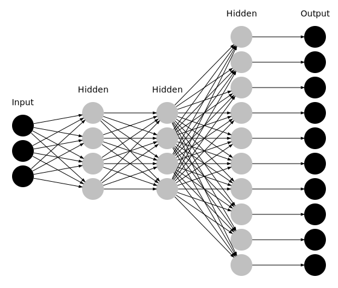

## Dotnets

A simple and yet flexible python script to build 2D Neural Networks using Graphviz library. This repository also contains a Jupyter Notebook with the script which helps in checking the correctness of the graph quickly without leaving the Jupyter Notebook workspace.

## Main steps involved
1. Importing the graphviz module
2. Set the Neural Network architecture defining parameters
3. Create nodes
4.  Create edges between the created nodes
5. Render and
6. Save/export

## Example graph

The following is an example graph of a 5 layered Neural Network with 3, 4, 4, 10, 10 nodes in each layer with **DENSE** connections in the starting layers and **SPARSE** connections between the last two layers.

